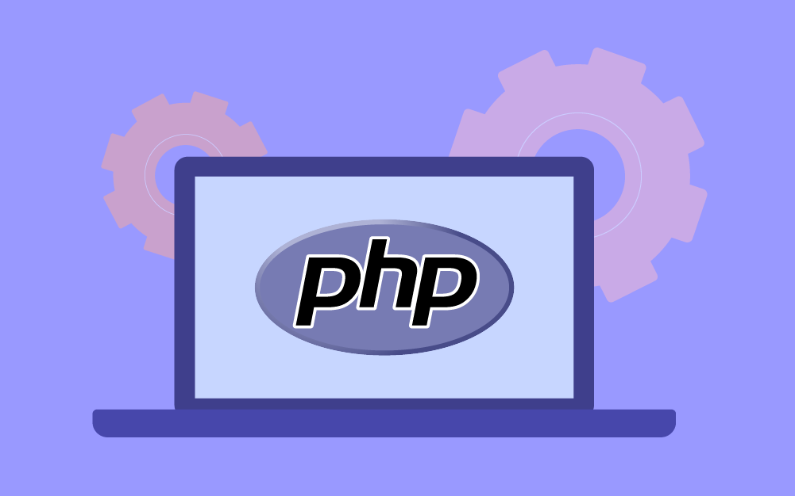
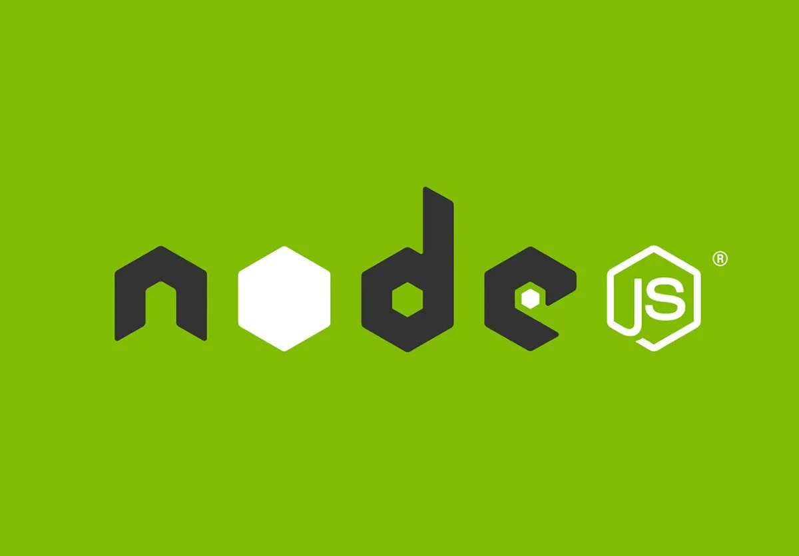

#  **Backend Development Roadmap**

The Backend Development Roadmap at IEEE ManCSC (Mansoura Computer Science Chapter) is a structured learning pathway designed to equip participants with the essential skills and tools for creating robust server-side applications. This roadmap is tailored for aspiring developers, offering a mix of theoretical knowledge and practical experience in backend technologies.

## **Roadmap Structure**

In this article, we will discuss the following sections:
1. [Entry Level](#entry-level)
2. [PHP Roadmap](#php-roadmap)
3. [Node.js Roadmap](#nodejs-roadmap)

 

<h2 id="entry-level">

**[1. Entry Level](./Entry/)**
</h2>

  

 

This level is for programmers who are new to the web development world. The entry level focuses on the fundamentals that each web developer should have in order to be able to understand upcoming challenges.

Main Topics:
* HTML, CSS
* Basic Networking
* Version Control
* Relational Databases

> After completing the entry level, the learner chooses between two learining pathes:

<h2 id="php-roadmap">

**[2. PHP Roadmap](./PHP/)**
</h2>

  

 

A roadmap to encountering PHP and implementing web applications using both native PHP and Laravel framework. More detailed topics are inside the roadmap directory.

<h2 id="nodejs-roadmap">

**[3. Node.js Roadmap](./Node.js/)**
</h2>

  

 

Encountering the JavaScript world by mastering JS programming, getting to know asynchronous execution, and then entering the Node.js zone. We will be learning `express` framework along with both relational and non-relational databases. We will get to know a lot of fun stuff about system design and best practices.

## **Contacts**

### Contributors
- [Seif El-Din Sweilam](https://github.com/saifsweelam)
- [Mohamed Elgamal](https://github.com/mohamed97163)

### IEEE ManCSC
- [csc.ieeemansb.org](csc.ieeemansb.org)
- [Facebook](https://www.facebook.com/ieeemancsc)
- [LinkedIn](https://www.linkedin.com/company/ieeemancsc/)
- [YouTube](https://www.youtube.com/channel/UCqXBZM5eGl7fs1Vzwvlc8CQ)
- Gmail : ieeemancsc@gmail.com